# Como contribuir

Os princípios, o estado do projeto e o jeito de trabalhar. O código em si está explicado em [docs/ARQUITETURA.md](docs/ARQUITETURA.md).

## Princípios do projeto

1. **Você decide, a IA executa.** A IA sugere, você aprova.
2. **Sem dados de mentira.** Nenhuma tela mostra exemplo inventado ou prévia falsa: o que você vê é o que sai.
3. **Gratuito por padrão.** O motor (Remotion, Whisper, FFmpeg) roda local e de graça. Só custa o que você escolher.
4. **Sem prender a um fornecedor.** A IA tem reserva: se o Gemini cair, entra o Claude.
5. **Seus dados ficam com você.** Projetos, biblioteca, tokens e métricas ficam em `backend/data/`.
6. **PT-BR primeiro.**

## Estado atual e próximos passos

| Parte | Estado |
|---|---|
| Tema → roteiro com pesquisa → voz → montagem → revisão → MP4 | ✅ Funciona |
| Peça um ajuste, desfazer, ajustes rápidos, controles da cena | ✅ Funciona |
| Legenda e cortes no tempo da voz (Whisper) | ✅ Funciona |
| Publicar no Instagram e no YouTube, agendar | ✅ Funciona |
| Ideias a partir das métricas | ✅ Funciona |
| Fundo da cena em 5 opções | 🔨 Fazendo agora |
| Imagens só da web, figurinhas por cena | 📋 A fazer ([ADR 0022](docs/decisions/0022-imagens-da-web-e-controles-da-cena.md)) |
| Ferramentas antigas (perfis, análises, gerador de prompts) | ⚠️ Legado, quase tudo *stub* |

O dia a dia está no [BOARD.md](BOARD.md). Para onde o projeto vai depois:



**Fora do escopo, de propósito:** depender de IA geradora de vídeo, scraping, bots de seguir/curtir e virar SaaS.

## Fluxo de trabalho

O projeto é feito por uma pessoa com a ajuda do Claude. O fluxo existe para o dono **entender cada mudança**, não só aceitar código gerado ([ADR 0014](docs/decisions/0014-board-em-arquivo-e-commit-por-tarefa.md)).



- **Board:** [BOARD.md](BOARD.md). Quem decide a prioridade é o dono.
- **Decisões:** quando há alternativas reais, é caro desfazer ou vira regra, escreve-se um **ADR** em [docs/decisions/](docs/decisions/README.md). Decisão grande ainda em aberto vira ADR *Proposta* e espera a escolha. Um ADR nunca é apagado: se a ideia muda, um novo substitui o antigo.
- **Commits:** [Conventional Commits](https://www.conventionalcommits.org/pt-br/) em PT-BR (`feat:`, `fix:`, `docs:`, `refactor:`, `test:`, `chore:`). A primeira linha diz *o quê*; o corpo diz *por quê*.
- **Diagramas:** cada um é um arquivo de texto [Mermaid](https://mermaid.js.org/) em [`docs/diagramas/`](docs/diagramas/) (`.mmd`), transformado numa imagem `.svg` que os documentos mostram. Para mudar um, edite o `.mmd` e gere a imagem de novo (veja [Comandos](#comandos)).
- **Pronto quando:** compila (`npx tsc --noEmit -p backend` e `-p frontend`), a tela foi testada no navegador (se mudou), a documentação (README e `docs/`) e o BOARD estão atualizados e a mudança foi explicada.

## Regras de código

- **TypeScript nos dois lados.** Evite `any` em código novo.
- **Backend:** `routes → controllers → services → storage`. Lógica no service; erro com `AppError`.
- **Frontend:** `página → hook → api`. CSS puro com as variáveis de `styles/index.css` (tema escuro, fonte Inter, amarelo `--accent`).
- **Vídeo** (`frontend/src/video/`): tem que dar o mesmo resultado na prévia e no MP4. Nada de `Math.random()` sem semente.
- **Produto** ([ADR 0011](docs/decisions/0011-editor-automatico.md)): a IA sugere e você aprova; sem linha do tempo nem trilhas; controle por cena só se começar no Automático; **sem dados de mentira nem prévias falsas**.
- **Nunca** coloque tokens ou chaves no código. Use o `.env`.

## Comandos

```bash
npm --prefix backend test
```

```bash
npx tsc --noEmit -p backend
```

```bash
npx tsc --noEmit -p frontend
```

Para gerar de novo as imagens dos diagramas, depois de editar um `.mmd` (na primeira vez, baixa o gerador e um navegador):

```powershell
Get-ChildItem docs/diagramas/*.mmd | ForEach-Object { npx -y @mermaid-js/mermaid-cli@11.4.2 -c docs/diagramas/mermaid.json -b white -i $_.FullName -o ($_.FullName -replace '\.mmd$', '.svg') }
```

Os testes usam Jest, só no backend por enquanto ([ADR 0015](docs/decisions/0015-framework-de-testes.md)); ficam ao lado do código (`*.test.ts`). O `tsc` do backend ainda acusa 18 erros antigos, que estão no BOARD.

## As decisões em um quadro

| Área | ADRs |
|---|---|
| Como decidir e trabalhar | [0001](docs/decisions/0001-registrar-decisoes-com-adrs.md) ADRs · [0014](docs/decisions/0014-board-em-arquivo-e-commit-por-tarefa.md) board e commit por tarefa · [0015](docs/decisions/0015-framework-de-testes.md) Jest · [0023](docs/decisions/0023-documentacao-enxuta-com-diagramas.md) documentação com diagramas |
| Dados e infraestrutura | [0002](docs/decisions/0002-armazenamento-em-json.md) JSON sem banco · [0003](docs/decisions/0003-cloudinary-para-url-publica.md) Cloudinary · [0012](docs/decisions/0012-render-em-processo-separado.md) render em processo separado |
| IA | [0004](docs/decisions/0004-gemini-com-reserva-automatica.md) Gemini com reserva · [0005](docs/decisions/0005-claude-code-do-plano-como-provedor.md) Claude Code do plano · [0006](docs/decisions/0006-remover-openai.md) sem OpenAI · [0008](docs/decisions/0008-claude-sonnet-como-reserva.md) Sonnet 5.5 como reserva |
| Produto e edição | [0009](docs/decisions/0009-remotion-para-composicao.md) Remotion · [0011](docs/decisions/0011-editor-automatico.md) editor automático · [0016](docs/decisions/0016-bordoes-de-abertura-e-final.md) bordões · [0017](docs/decisions/0017-troca-de-imagem-rapida-e-chat-na-cena-certa.md) chat na cena certa · [0018](docs/decisions/0018-legenda-sincronizada-com-a-voz.md) legenda no tempo da voz · [0019](docs/decisions/0019-roteiro-com-argumento-e-tons-proprios.md) roteiro com argumento · [0020](docs/decisions/0020-imagens-especificas-memes-e-zoom.md) imagens específicas e memes · [0021](docs/decisions/0021-ideias-a-partir-do-desempenho.md) ideias · [0022](docs/decisions/0022-imagens-da-web-e-controles-da-cena.md) imagens da web e controles da cena |

Substituídas (ficam pelo histórico): [0007](docs/decisions/0007-claude-haiku-como-reserva.md), [0010](docs/decisions/0010-biblioteca-de-imagens-em-vez-de-geracao.md) (em parte), [0013](docs/decisions/0013-workflow-kanban-github-projects.md).
