# InstaSearch

**Do tema ao Short narrado, com você no controle.**

Você escreve um assunto (*"Por que o Luffy nunca mata ninguém?"*) e grava a voz. A IA pesquisa e escreve o roteiro; o app monta o vídeo (imagens, legendas, setas, figurinhas, efeitos sonoros e música), mostra a **prévia ao vivo**, aplica os ajustes que você pedir e publica no **Instagram** e no **YouTube**. Depois, mede como cada vídeo foi e sugere os próximos temas.



🟨 **você decide** · 🟦 **a IA sugere** · 🟩 **o app executa**

## Por que existe

Shorts narrados trocam de imagem a cada segundo: são 25 a 40 imagens num vídeo de 40 s, com legendas e efeitos no tempo da fala. Editar isso à mão leva horas, e as ferramentas que automatizam costumam gerar tudo por IA, com cara de genérico.

O InstaSearch é um **editor automático**: a IA monta, você revisa e pede mudanças em texto ("na cena 6 põe um X"). Ele **não** gera vídeo por IA, **não** é um SaaS e **nada** é publicado sem a sua revisão. Roda no seu computador, com as suas chaves, e o motor é gratuito.

**Feito com:** React + Vite, Node.js + Express, TypeScript, [Remotion](https://www.remotion.dev/) (o vídeo), Whisper (transcrição local) e Gemini com o Claude de reserva (IA).

## Documentação

| Quero… | Leia |
|---|---|
| Usar o app: o caminho de um vídeo, tela por tela | [docs/USO.md](docs/USO.md) |
| Instalar e conectar Instagram, YouTube e IA; custos | [docs/INSTALACAO.md](docs/INSTALACAO.md) |
| Entender o código, com diagramas | [docs/ARQUITETURA.md](docs/ARQUITETURA.md) |
| Contribuir: princípios, estado atual, regras e comandos | [CONTRIBUTING.md](CONTRIBUTING.md) |
| Ver o que está sendo feito agora | [BOARD.md](BOARD.md) |
| Saber **por que** algo foi decidido | [docs/decisions/](docs/decisions/README.md) |

## Começo rápido

Precisa de Node.js 20+, FFmpeg e uma chave do [Gemini](https://aistudio.google.com/app/apikey). Detalhes em [docs/INSTALACAO.md](docs/INSTALACAO.md).

```bash
git clone https://github.com/Edugiyuu/InstaSearch.git
cd InstaSearch
npm --prefix backend install
npm --prefix frontend install
cp backend/.env.example backend/.env
cp frontend/.env.example frontend/.env
```

Preencha a `GEMINI_API_KEY` no `backend/.env`, rode `npm --prefix backend run dev` e `npm --prefix frontend run dev` (dois terminais) e abra http://localhost:5173.

> ⚠️ Feito para rodar em `localhost`: o backend não tem login. Veja os [avisos de segurança](docs/INSTALACAO.md#segurança-e-avisos).

## Licença

[MIT](LICENSE)
