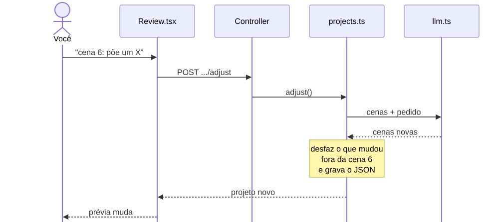
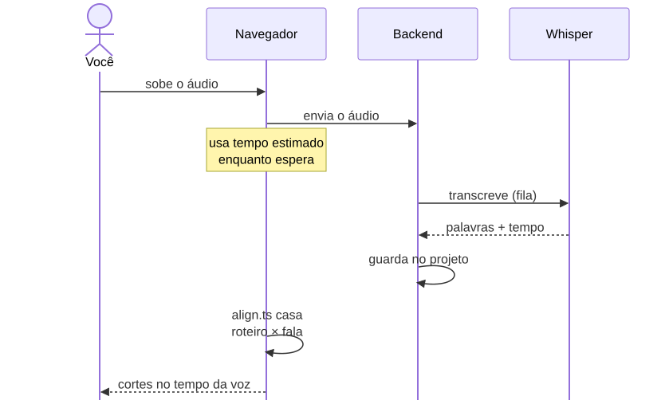
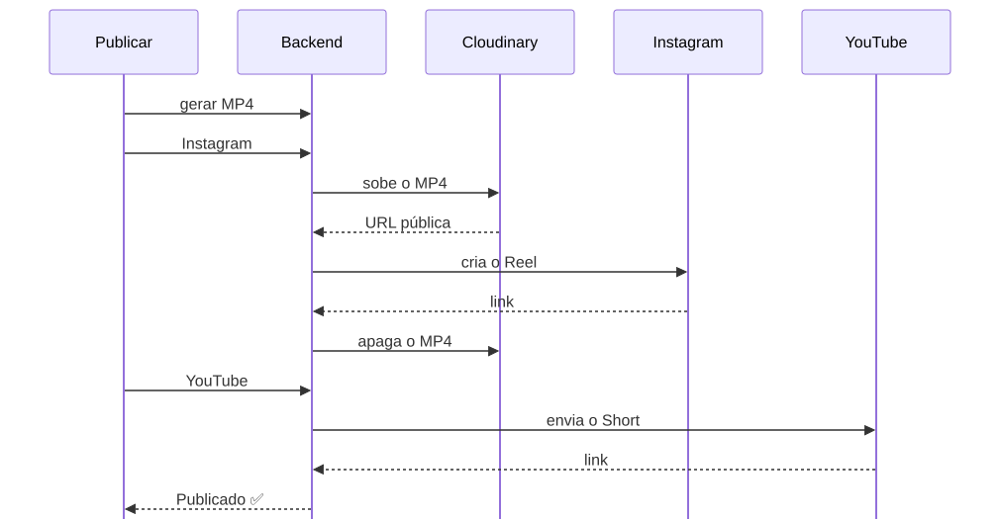

# Arquitetura: como o InstaSearch funciona por dentro

Para quem quer entender ou mexer no código. O uso de cada tela está em [USO.md](USO.md); as regras de código, no [CONTRIBUTING.md](../CONTRIBUTING.md).

## O mapa geral



| Peça | Tecnologia | Por quê |
|---|---|---|
| Frontend | React 18, Vite, TypeScript, CSS puro | A mesma linguagem do vídeo (Remotion também é React) |
| Backend | Node.js, Express, TypeScript | Simples, uma linguagem só no projeto inteiro |
| Dados | Arquivos JSON, um por item ([ADR 0002](decisions/0002-armazenamento-em-json.md)) | Zero configuração; troca para SQLite quando crescer |
| Vídeo | [Remotion](https://www.remotion.dev/) ([ADR 0009](decisions/0009-remotion-para-composicao.md)) | O vídeo é um componente React: a prévia ao vivo e o MP4 saem do **mesmo código** |
| Transcrição | whisper.cpp local ([ADR 0018](decisions/0018-legenda-sincronizada-com-a-voz.md)) | Grátis e privado; dá o tempo de cada palavra |
| IA | Gemini, com reserva no Claude Sonnet 5.5 ([ADR 0004](decisions/0004-gemini-com-reserva-automatica.md), [0008](decisions/0008-claude-sonnet-como-reserva.md)) | Gemini é grátis; o Claude cobre quando a cota acaba |
| Publicação | Instagram Graph API + Cloudinary ([ADR 0003](decisions/0003-cloudinary-para-url-publica.md)), YouTube Data API | O Instagram só aceita vídeo por URL pública, e o Cloudinary dá essa URL de graça |

## As camadas do código

Cada lado tem um caminho fixo. Saber o caminho é saber onde procurar qualquer coisa:



- O **controller** fica fino: só tira os dados do pedido, chama o service e devolve `{ "success": true, "data": … }`. Erros são `AppError(mensagem, status, código)`, que o `errorHandler` transforma em `{ "success": false, "error": { code, message } }`.
- Serviço externo (IA, busca, Instagram) **nunca** é chamado direto do controller: passa por um service (*provider*), para poder ser trocado.
- Algumas páginas maiores, como a Revisão, chamam o `api/shorts.ts` direto, sem hook.

Exemplo real, do clique à prévia, quando você pede um ajuste:



## O projeto e as cenas (o modelo de dados)

Tudo de um vídeo fica num arquivo só: `backend/data/short_projects/<id>.json`. O tipo está em [`backend/src/services/shorts/types.ts`](../backend/src/services/shorts/types.ts) e é espelhado no frontend em [`frontend/src/api/shorts.ts`](../frontend/src/api/shorts.ts).



- **Beat** é uma **cena**: um trecho da fala (`say`), a legenda curta (`text`), o que a imagem precisa mostrar (`query`), os personagens, o tipo (`full` ou `evidence`, a "prova"), o efeito (seta, X, círculo, reação), a imagem escolhida e se ela bateu (`match`, `similar`, `missing`).
- Os campos `…Locked` e `framing` guardam o que **você** escolheu à mão; a montagem e o chat respeitam.
- `status` segue a vida do vídeo: `roteiro` → `revisao` → `salvo` / `agendado` → `publicado`.

## A IA: quem responde

Todo pedido de IA do fluxo de Shorts passa por um único arquivo, [`llm.ts`](../backend/src/services/shorts/llm.ts). Ele tenta um provedor de cada vez:



Quando o Gemini responde *429* (cota), o app lê o horário em que a cota volta e o deixa de lado até lá, sem gastar tentativas. `LLM_PROVIDER` no `.env` força um provedor só.

| Onde a IA trabalha | Entra → sai |
|---|---|
| Roteiro | tema + estilo + tom → título, narração e cenas (pesquisa na web antes) |
| Peça um ajuste | cenas + pedido → cenas novas + resposta |
| Escolher imagens | cena + miniaturas da web → a que mostra o personagem certo, ou nenhuma (visão) |
| Catalogar | imagem ou som → personagens, etiquetas, áreas de zoom |
| Legenda do post | título + narração → legenda + hashtags |
| Ideias | métricas + comentários + web → 6 ideias com provas |

Gasto típico por vídeo: 1 chamada no roteiro, umas 4 para escolher imagens, 1 por ajuste.

## Montagem e imagens



A regra é a do [ADR 0020](decisions/0020-imagens-especificas-memes-e-zoom.md): **o personagem é obrigatório, a ação é preferência**. Melhor uma cena vazia, que você vê, do que uma imagem errada, que passa.

> **Mudando agora:** o [ADR 0022](decisions/0022-imagens-da-web-e-controles-da-cena.md) tira a biblioteca de imagens da montagem (o losango "Biblioteca tem imagem…"): cada vídeo vai buscar as suas na web. Está em "A fazer" no [BOARD](../BOARD.md).

Depois das imagens, a montagem põe as **figurinhas** (pela etiqueta da reação, ex.: "chocado"; o vídeo não desenha emoji), os **efeitos sonoros** (pelo tipo de efeito e pelo nome do arquivo) e a **música** (pelo clima do estilo).

## Voz, legenda e cortes no tempo certo



O texto da legenda continua o do roteiro: se o Whisper ouvir "Sucuna", a tela ainda escreve "Sukuna". Na primeira vez, o app baixa o Whisper e o modelo `small` (~490 MB) para `backend/tools/whisper/`.

## Prévia e MP4 saem do mesmo código



O render roda num **processo separado**, com o código do frontend ([ADR 0012](decisions/0012-render-em-processo-separado.md)): assim não existem duas cópias do vídeo para manter iguais. Um *hash* das props diz se o MP4 guardado ainda é o vídeo atual.

## Publicar



O **agendador** (Calendário) roda dentro do backend e confere a cada 1 minuto se há post para publicar. Ele **só publica com o backend ligado** no horário; se o PC estiver desligado, publica quando o backend subir de novo.

## Ideias: o ciclo de aprendizado



Comparar com a **sua mediana na mesma idade** evita a armadilha de comparar um vídeo de 2 dias com um de 2 meses. Com menos de 10 vídeos medidos, a tela avisa que ainda é cedo para tirar padrão.

## Onde ficam os dados

Tudo em `backend/data/`, que está no `.gitignore`. **Backup = copiar essa pasta.**

```
backend/data/
├── short_projects/      um JSON por vídeo  (+ audio/ narrações, renders/ MP4)
├── library/             imagens, vídeos e figurinhas  (+ files/)
├── sounds/              efeitos sonoros e músicas  (+ files/)
├── bordoes/  tones/  styles/      o que você cria na Biblioteca e em Estilos
├── ideas/  metrics/     banco de ideias e fotos das métricas
├── instagram_accounts/  youtube/  contas conectadas ⚠️ tokens em texto puro
└── posts/  videos/ …    agendamentos e as telas antigas
```

## Mapa das pastas do código

```
backend/src/
├── routes/api.ts              todas as URLs da API
├── controllers/               um por área: shorts, ideas, insights, youtube, instagram…
├── services/
│   ├── shorts/                o fluxo tema → Short
│   │   ├── llm.ts             a fila de IAs (Gemini → Claude)
│   │   ├── shortsAI.ts        os prompts: roteiro, ajuste, escolher e catalogar imagens
│   │   ├── projects.ts        criar, montar, ajustar, desfazer, transcrever
│   │   ├── library.ts         biblioteca e escolha por cena
│   │   ├── imageSearch.ts     busca na web (Bing, Danbooru, AniList, Serper)
│   │   ├── sceneEdits.ts      o chat só mexe nas cenas citadas
│   │   ├── transcription.ts   Whisper local
│   │   ├── render.ts · publish.ts   MP4, Instagram e YouTube
│   │   └── types.ts           ShortProject, Beat… (o modelo de dados)
│   ├── insights/              coleta e comparação das métricas
│   ├── ideas/                 brainstorm e banco de ideias
│   └── storage/               FileStorage: um JSON por item
└── middleware/errorHandler.ts AppError + asyncHandler

frontend/src/
├── pages/                     uma por tela
├── hooks/                     estado das telas (loading, error)
├── api/                       chamadas ao backend, com os tipos
├── video/                     a composição Remotion (prévia e MP4)
├── components/                menu, modal de publicar, pop-ups da cena…
└── styles/                    tokens de cor (index.css) e componentes (ui.css)
```
