# Como usar o InstaSearch

O caminho de um vídeo, tela por tela, as outras telas do app e um glossário dos termos. Para instalar, veja [INSTALACAO.md](INSTALACAO.md); para entender o código, [ARQUITETURA.md](ARQUITETURA.md).

## Quem faz o quê

🟨 **você decide** · 🟦 **a IA sugere** · 🟩 **o app executa**

| Etapa | Quem faz |
|---|---|
| Tema, estilo, tom e duração | **Você** (ou um clique numa ideia guardada) |
| Roteiro com argumento e provas, dividido em cenas | **IA** (pesquisa na web antes de escrever) |
| Voz | **Você**: celular, microfone, ElevenLabs |
| Legenda e cortes no tempo da sua fala | **App** (Whisper, no seu computador) |
| Imagem, figurinha, efeito sonoro e música de cada cena | **App + IA** |
| Conferir e pedir mudanças ("na cena 6 põe um X") | **Você**, na prévia ao vivo |
| Render do MP4 e publicação | **App** |

## A jornada de um vídeo, tela por tela

### 1. Novo vídeo

- **Tema** ("Por que o Luffy nunca mata ninguém?"), **estilo** (Comentário de anime, Explicativo, Curiosidades, História, Ranking, Edit, POV ou um seu), **duração** (15 a 40 s) e **tom**.
- **Tons** são o jeito de falar do roteiro: vêm *Polêmico*, *Curioso*, *Mistério* e *Papo reto*, e você cria os seus (à mão ou descrevendo para a IA) em **Biblioteca → Tons** ([ADR 0019](decisions/0019-roteiro-com-argumento-e-tons-proprios.md)).
- Já tem o texto? Marque **"Já tenho o texto da narração"**: a IA só divide em cenas, sem mudar nada.
- **Gerar roteiro**: a IA faz até **4 buscas na web** atrás de provas e escreve na estrutura *gancho → tese → provas concretas → conclusão → chamada para comentar*. A tela mostra o que ela buscou e **qual IA escreveu** (selo azul = Gemini, laranja = Claude).

### 2. Roteiro e voz

- Cada cena tem a **legenda** (amarela), a **fala** e o que a imagem precisa mostrar. Tudo é editável; o ✕ tira a cena.
- **Peça uma mudança** no topo ("gancho mais polêmico", "tira a parte do Kaido").
- **Sua voz:** copie a narração, grave e suba o áudio. Dá para montar sem áudio e subir depois.

### 3. Montagem

Você não faz nada: o app escolhe uma imagem por cena, põe as figurinhas de reação, os efeitos sonoros nos cortes (whoosh nas setas, erro nos X, boom no gancho) e uma música do clima do estilo. A tela mostra cada decisão e abre a revisão sozinha. Como as imagens são escolhidas está em [ARQUITETURA.md](ARQUITETURA.md#montagem-e-imagens).

### 4. Revisão

O centro do app. A **prévia ao vivo** é a composição final: o que você vê é exatamente o que vai para o MP4.

- **Barra de cenas** abaixo do vídeo: 🟥 sem imagem, 🟧 imagem parecida, pontinho laranja = cena com som. Clique para pular (`/projeto/:id?cena=3` abre direto numa cena).
- **Controles da cena**, numa linha sob a barra ([ADR 0022](decisions/0022-imagens-da-web-e-controles-da-cena.md)). Tudo começa no **Automático** (o que a IA fez); o que você escolhe fica travado e a montagem não troca mais.
  - **🖼 Trocar**: abre a tela Trocar imagem dessa cena.
  - **▣ Fundo**: como a imagem aparece (tabela abaixo).
  - **🔊 Efeito sonoro**: automático, sem som ou qualquer som da sua biblioteca, com **▶** para ouvir.
- **✨ Peça um ajuste**: um chat. Cite cenas pelo número da tela ("na cena 6 põe um X", "cenas 3 e 4", "esta cena"). Se o pedido cita cenas, **só elas mudam**: se a IA mexer em outra, o app desfaz. A resposta diz o que *de fato* mudou, conferido pelo app ([ADR 0017](decisions/0017-troca-de-imagem-rapida-e-chat-na-cena-certa.md)). **Desfazer** volta a versão anterior.
- **Precisa de você**: cenas sem imagem ou com imagem parecida → **Resolver agora** ou **✨ Preencher automático**.
- **Ajustes rápidos** (valem para o vídeo inteiro):

| Ajuste | Opções |
|---|---|
| Ritmo | Calmo · Normal · Rápido · Frenético (a IA junta ou divide cenas, sem mudar a fala) |
| Efeitos | Poucos · Na medida · Muitos (setas, X, círculos, reações) |
| Legenda | Quadrinho (1 a 3 palavras-chave) · **Completa** (toda a fala, a palavra dita acende) · Limpa · Sem |
| Música | uma da biblioteca · Sem música (ela abaixa sozinha quando tem voz) |
| Bordão de abertura / do final | Nenhum · um dos seus bordões ([ADR 0016](decisions/0016-bordoes-de-abertura-e-final.md)) |

**▣ Fundo da cena**, um pop-up com uma miniatura de cada jeito, feita com a imagem da própria cena:

| Opção | Como fica |
|---|---|
| Automático | O que a IA escolheu: cena de *prova* vai na moldura; imagem larga aparece inteira sobre ela mesma desfocada; imagem em pé, em tela cheia |
| Tela cheia | Corta para ocupar a tela toda |
| Inteira | A imagem toda, sobre ela mesma desfocada |
| Moldura no quadriculado | Emoldurada e inclinada, no fundo quadriculado das provas |
| Moldura sobre a imagem | A mesma moldura, com a própria imagem desfocada atrás |

Vale na prévia e no MP4. Se o chat trocar a imagem ou o tipo da cena, o fundo volta para o Automático.

### 5. Trocar imagem

Uma cena por vez ("Cena 1 de 3"). A tela já abre com **sugestões da internet** buscadas a partir do que a cena precisa mostrar:

| Fonte | O que traz | Precisa de chave? |
|---|---|---|
| Bing Imagens | Resultados gerais e **painéis de mangá** (primeiro, em estilos de mangá) | Não |
| Danbooru | Ilustrações classificadas como "geral", filtradas pelas etiquetas da cena (`smirk`, `hands_in_pockets`…) | Não |
| AniList | A arte oficial do personagem (desempata "Sakura" pela série do vídeo) | Não |
| Google Imagens | Via [serper.dev](https://serper.dev), 2.500 buscas grátis | `SERPER_API_KEY` |

**Clique numa** e pronto: ela entra na cena e a tela passa para a próxima. Também dá para colar (Ctrl+V), arrastar um arquivo, colar um link ou buscar outro texto. Cenas marcadas com **meme** ou **variação** (chibi, versão mulher) ganham o botão **😂 Buscar o meme** ([ADR 0020](decisions/0020-imagens-especificas-memes-e-zoom.md)).

### 6. Publicar

O modal gera a **legenda do post** com hashtags e já começa o **render do MP4** (1080×1920, 30 fps). O primeiro render demora mais (prepara o Remotion e baixa o Chrome headless); se o vídeo não mudou, o MP4 guardado é reaproveitado.

- **⬇ Baixar MP4**, **Publicar no Instagram** (Reels) ou **Enviar ao YouTube** (Short, com título e privacidade).
- Depois de publicar, o projeto vai para **Projetos → Publicados**, e as métricas dele passam a alimentar a tela [Ideias](#as-outras-telas).

## As outras telas

| Tela | Para quê |
|---|---|
| **Início** (`/`) | Criação rápida (tema + estilo + Começar), seus vídeos e próximas publicações |
| **Projetos** (`/projetos`) | Todos os vídeos, filtrados por etapa: no roteiro, faltam imagens, prontos, salvos, publicados |
| **Ideias** (`/ideias`) | **Desempenho**: cada Reel e Short comparado com a mediana dos seus vídeos na mesma idade ("2,4× a sua mediana, aos 7 dias"). **Ideias**: a IA propõe lotes de 6 temas, cada um com as provas (seus números, comentários do público, o que está em alta na web). Guardar, descartar com motivo, **Criar vídeo** ([ADR 0021](decisions/0021-ideias-a-partir-do-desempenho.md)) |
| **Biblioteca** (`/biblioteca`) | O material que você cuida: figurinhas (PNG transparente), efeitos sonoros (nomeie `whoosh_01.mp3`), músicas (cole o link de um Reel/TikTok/Short), bordões, tons e vídeos. A aba Imagens está de saída ([ADR 0022](decisions/0022-imagens-da-web-e-controles-da-cena.md)) |
| **Estilos** (`/estilos`) | Cada estilo é uma configuração (ritmo, efeitos, legenda, música, tipo de imagem, instruções para a IA). Mudar um que vem com o app salva uma cópia sua |
| **Calendário** (`/calendario`) | Posts agendados, publicados e com falha; publicar agora, cancelar |
| **Configurações** (`/configuracoes`) | Contas conectadas (Instagram, YouTube), estado de cada IA (com a hora em que a cota do Gemini volta) e o download do Whisper |
| Ferramentas antigas | As telas da primeira versão do projeto (publicar clipes prontos, gerador de prompts, perfis). Ficam no rodapé do menu; a maioria é *stub* |

**Bordões** são o que abre ou fecha o vídeo, em três tipos: **clipe pronto** (um vídeo seu com som), **montado** (imagem + um áudio seu + texto) e **se inscreve** (foto, @, frase e o botão sendo clicado).

## Glossário

| Termo | O que é |
|---|---|
| **Cena** (*beat*, batida) | Um pedaço do vídeo: um trecho da fala com uma imagem. Um Short costuma ter de 10 a 40 |
| **Prova** (*evidence*) | Cena que mostra um print ou painel como evidência, emoldurada e inclinada |
| **Estilo** | Receita de edição: ritmo, efeitos, legenda, música, tipo de imagem |
| **Tom** | Jeito de falar do roteiro (Polêmico, Mistério…) |
| **Bordão** | O que abre ou fecha todo vídeo, como uma vinheta |
| **Figurinha** | Imagem de reação (PNG transparente) que aparece sobre a cena |
| **Automático** | O valor que a IA escolheu. Todo controle da cena começa nele |
| **Travado** (*locked*) | Escolha sua que a montagem e o chat não trocam mais |
| **Montagem** | O passo em que o app põe imagem, figurinha, som e música em cada cena |
| **Reserva** (*fallback*) | A IA que entra quando a anterior falha |
| **Remotion** | Biblioteca que descreve vídeo como componentes React |
| **Whisper** | Programa que transcreve áudio e dá o tempo de cada palavra |
| **ADR** | *Architecture Decision Record*: o registro do porquê de uma decisão |
